# Remotion at BOL — A Show & Tell

> Companion deck for walking BOL staff through what Remotion is, what it can do for our work, and where it fits in the brand toolkit.
>
> All scenes referenced below live as standalone compositions in the **bol-remotion-demo** app. Open the studio at **http://localhost:3001** and click any composition name in the left rail to scrub through it live. Stills are pre-rendered to `docs/stills/` so this doc has visual reference even if the studio isn't running.

---

## 1. What is Remotion (in one sentence)

> **Remotion is React for video.** You write components, drive every animation by a frame number, and Remotion renders the result frame-by-frame — to a video file (MP4 / WebM / ProRes), an image (PNG), or a live preview in the browser.

Three things that make it different from After Effects / Premiere / Photoshop:

1. **Code is the source.** Every animation is a React component. The brand book _is_ the codebase. Change a token, every video updates.
2. **Frame-perfect by construction.** No timeline drift, no key-framing fatigue. `useCurrentFrame()` is the only timing primitive.
3. **Parametric.** A composition can take props. One template → 50 personalized videos.

---

## 2. Why this matters for BOL

| What we do today                              | What Remotion changes                                                                  |
| --------------------------------------------- | -------------------------------------------------------------------------------------- |
| Animate logos & lower-thirds in After Effects | Animate them in code, version-controlled, reviewable in PR                             |
| Re-render every variant by hand               | Drive variants from data — render 50 personalized clips overnight                      |
| Brand book lives in PDFs + Figma              | Brand book lives in `theme.ts` — reused across every composition                       |
| Designer ↔ developer handoff                 | Designer authors a Lottie/SVG, dev wires it up — both edit text in the same React file |

This demo app is a curated audition pool. **Pick the 6–10 vignettes that read most strongly to BOL voice and we cut a ~60s show reel from those.**

---

## 3. Touring the studio (30 seconds before scenes)

Before scrubbing through scenes, orient your audience to the chrome. The studio at **http://localhost:3001** is divided into five panels — point them out in this order so everything that follows makes sense.

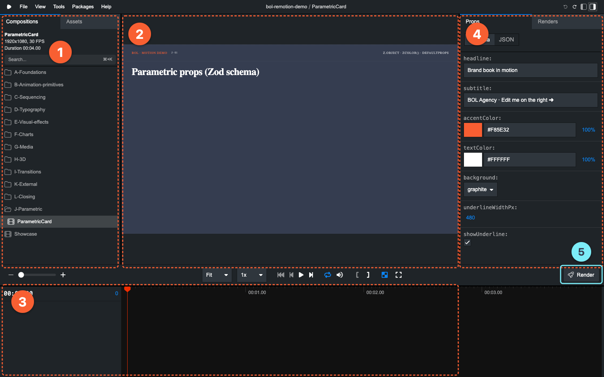

> _Studio with `ParametricCard` selected. The five numbered callouts match the panels below._

### The five panels

1. **Composition list (left rail).** Every scene we'll show is a separate composition listed here, grouped by capability folder (`A-Foundations`, `B-Animation-primitives`, … `L-Closing`) matching this deck's section letters. The master `Showcase` sits at the top, ungrouped. Click any name to load that composition into the preview.

2. **Preview pane (center).** This is exactly what gets rendered as a frame. WYSIWYG — there is no "it'll look different on export." All audition scenes are 1920×1080 @ 30fps.

3. **Timeline scrubber (bottom).** A frame-accurate playhead. Click anywhere on the timeline to jump there. Spacebar plays / pauses. The frame number and timecode on the left are the current position; the duration on the right is the composition's full length.

4. **Props panel (right side, "Props" tab).** Empty for most scenes. **Click the `ParametricCard` composition under `J-Parametric` and the panel populates** with text inputs, color pickers, a background dropdown, a number slider, and a checkbox. Edit any value — the preview re-renders instantly. _This is the live editing story; budget 20 seconds here._

5. **Renders panel (right side, "Renders" tab).** Kick off MP4 / WebM renders from the UI. The CLI is faster for repeat work but this panel is how non-coders get a video out of the studio.

### Five things to call out as you tour

| What                                                      | Why staff should care                                                                                 |
| --------------------------------------------------------- | ----------------------------------------------------------------------------------------------------- |
| **Folder structure in the left rail**                     | "Same organization as the deck. You're going to scrub each one."                                      |
| **Frame number under the playhead**                       | "Every animation we'll show is just math on this number."                                             |
| **Hot Module Reload** (mention; you'll see it indirectly) | "When the developer saves a code change, this preview updates in under a second."                     |
| **The Props panel on `ParametricCard`**                   | "This is the no-code editing surface. A designer can change colors and copy without touching a file." |
| **The Renders tab**                                       | "When we like a take, this button produces an MP4. No After Effects, no Premiere."                    |

### A scripted 30-second tour

> "What you're looking at is the same React application that produces our final renders, with a frame scrubber bolted on. Down the left, every scene we'll go through tonight. Center is the preview — exactly what ships. Bottom is the frame-accurate timeline. Right is two tabs: Props for live editing, Renders for shipping. I'll click `ParametricCard` to show you what 'live editing' means here, then we'll go scene by scene."

— _Click ParametricCard. Edit headline. Edit accent color. Watch preview update. Move to scene 1 of the audition._

### Bonus: 90 seconds on project anatomy (optional)

> _Skip if your audience is purely visual. Helpful for technically-curious staff who want to know "where do the files live?"_

This isn't one Remotion project — it's a **monorepo of seven** sharing a brand toolkit. Open the repo at `~/Documents/GitHub/remotion-studio-monorepo/`. Five things to point out:

1. **`apps/`** — Each subfolder is a self-contained Remotion project with its own studio, deps, and renders. The current count: `bol-remotion-demo` (this deck), `miter-llm-webinar` (the BOL+Miter client work), `pixel-typography` (typography experiments), `studio` (a Next.js dashboard for browsing all the apps), `examples`, `_template` (the scaffold), `3D-template` (3D scaffold). Run `pnpm create:project <name>` to mint a new app from the template — one command.

2. **`packages/@studio/`** — Shared workspace packages used by _any_ app. Six of them today:
   - `core-types`, `easings`, `timing`, `hooks` — animation primitives reused across projects
   - `transitions` — shared transition presentations
   - **`kinetic-captions`** — the SRT-driven caption engine that drives the Miter webinar app's word-by-word captions, registered tonight
3. **`scripts/`** — Eleven repo-level helpers including `create-project.ts`, `forge.ts`, `render-app.ts`, `analyze-bundle.ts`, `upgrade-remotion.ts`. The command surface that keeps the monorepo coherent.

4. **`docs/`** — Twenty-eight bilingual (EN + JA) markdown docs covering architecture, asset handling, getting started, recipes, troubleshooting, and Remotion upgrade procedure. Consult these when you onboard a new dev or revisit infrastructure.

5. **Inside any app** (e.g. `apps/bol-remotion-demo/`):
   - `src/` — your code. `Root.tsx` registers compositions; `scenes/` holds one file per scene; `styles/theme.ts` is the brand kit; `components/` is shared UI helpers.
   - `public/` — static assets (audio MP3s, Lottie JSON, images). Loaded via Remotion's `staticFile()`.
   - `out/` — rendered MP4s and PNG stills (gitignored).
   - `docs/` — app-specific deck + screenshots (this file lives here).
   - `package.json` — declares deps and the `dev` / `build` / `lint` scripts.

> **Talking point:** "Notice how little is special about each app — they're all React projects sharing one design system. When the brand evolves, we update one file in `packages/@studio/` and every app inherits the change at next render."

---

## 4. The audition pool (34 scenes)

Each scene is its own composition. In studio, click the name in the left rail to scrub.

### A. Foundations — _the heartbeat_

#### `Title` &nbsp; _Composition: `Title`_ &nbsp; _Duration: 4s_

The opening card. Establishes brand: graphite background, cyan subtitle, sentence-case headline, BOL-orange underline. Notice the springs — every element settles with physics, not linear fade.

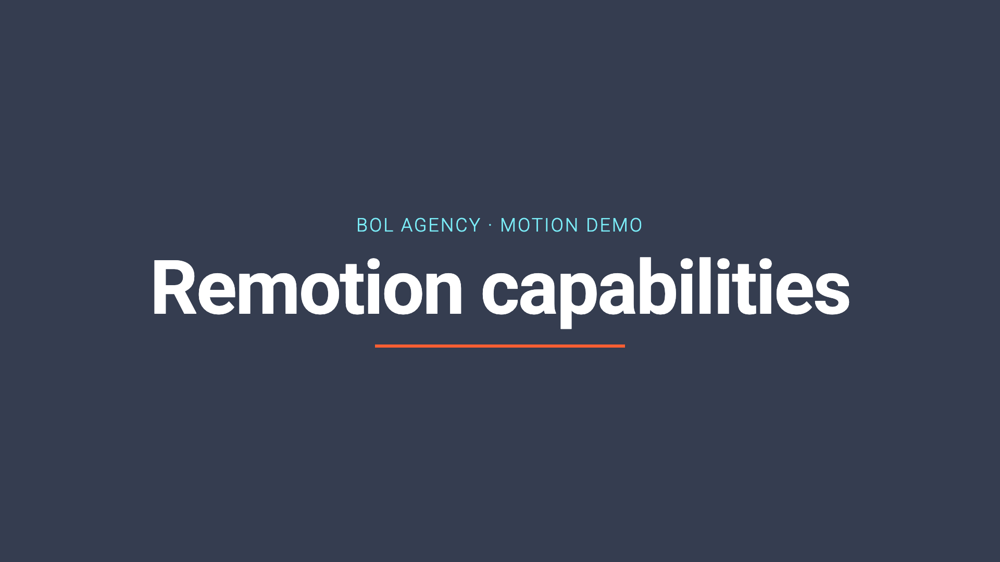

#### `FrameRuler` &nbsp; _Composition: `FrameRuler`_ &nbsp; _Duration: 6s_

The pedagogical opener. Big number ticks up; ruler at the bottom shows where you are in the timeline. **Every other animation in the deck is just math on this number.**

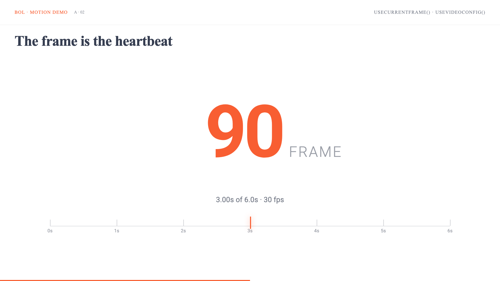

> **Talking point:** "There's no timeline software here. There's a number — the current frame — and React. Everything else is composition."

---

### B. Animation primitives — _the verbs_

#### `EasingZoo` &nbsp; _Duration: 6s_

Five dots race across the same track with five different easing curves. Linear vs in-quad vs out-quad vs inOut-quad vs custom Bezier. Demonstrates how _the same animation_ feels completely different with different timing functions.

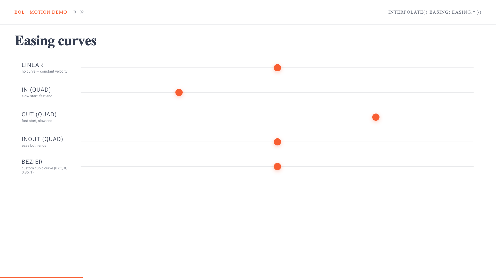

> **Talking point:** "These are the same five lines of code, just with `easing: Easing.in(Easing.quad)` swapped to a different curve. That's all that separates 'janky' from 'high-end' motion."

#### `SpringTuning` &nbsp; _Duration: 6s_

Same scale animation, four spring presets side by side: smooth (no bounce), snappy, bouncy, heavy. Shows how `damping`, `stiffness`, and `mass` shape feel.

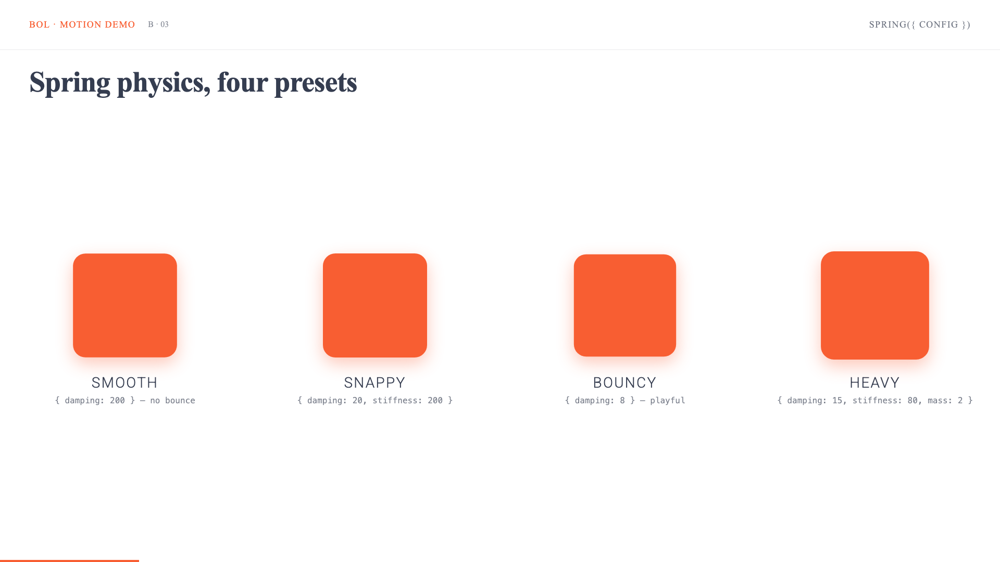

#### `SpringVsInterpolate` _(existing)_ &nbsp; _Duration: 6s_

The two big timing primitives in Remotion, side-by-side. Spring = physics. Interpolate = explicit curve. Most production motion uses both — entrance via spring, exit via interpolate-with-easing.

#### `ColorInterpolation` &nbsp; _Duration: 6s_

`interpolateColors()` tweens through the BOL palette: cyan → orange → graphite → cyan. Hex codes update in real time below the swatch.

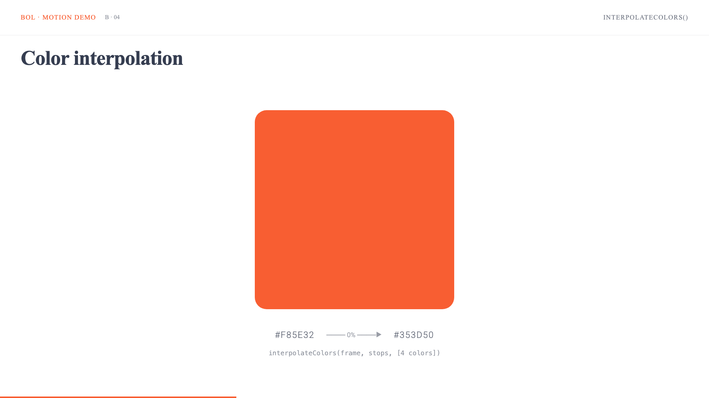

> **Talking point:** "When the brand color shifts, every video updates. No re-render of any composition file."

---

### C. Sequencing — _the timeline_

#### `SequenceLadder` &nbsp; _Duration: 6s_

Five branded cards (Brief → Concept → Build → Review → Ship) each enter at a staggered `from` frame. The bottom ruler labels each `from=N` so the staggered cadence is legible.

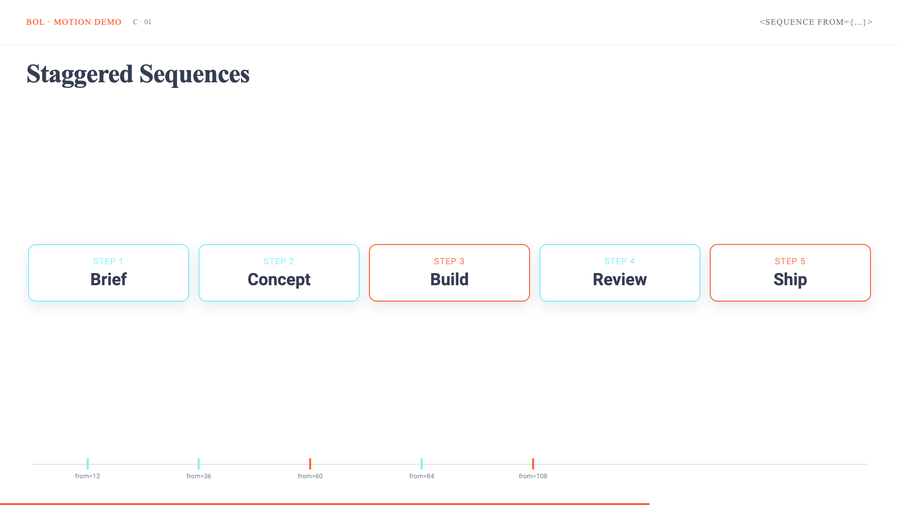

> **Talking point:** "This is the building block for any process video, sales-funnel explainer, or product walkthrough."

#### `SeriesSequence` &nbsp; _Duration: 6s_

Three cards (Brief → Build → Ship) play one-after-another using `<Series>`. The whole point is that **`<Series>` automates the `from`-frame math** — you don't write `from={0}`, `from={60}`, `from={120}` by hand. Change a step's duration and everything downstream re-flows automatically.

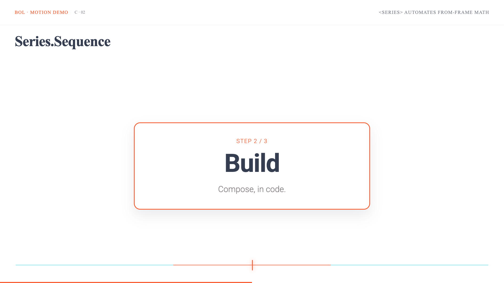

> **Talking point:** "If `Sequence` is the manual transmission, `Series` is the automatic. Same outcome, fewer ways to get the math wrong."

#### `LoopFreeze` &nbsp; _Duration: 6s_

Three columns hosting the same pulse animation, each wrapped differently:

- **Normal** — `<Pulse />` plays once, settles.
- **Looped 3×** — `<Loop times={3}>` repeats the same animation back-to-back.
- **Frozen @15** — `<Freeze frame={15}>` pins `useCurrentFrame()` to 15. The animation never moves.

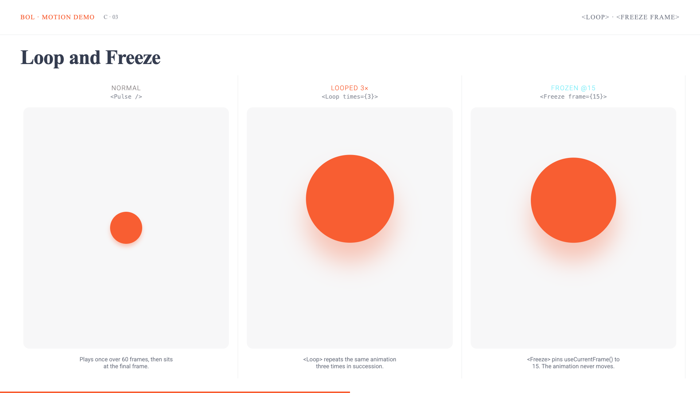

> **Talking point:** "`Loop` is for badges, gifs, idle states. `Freeze` is for pinning a poster frame — useful when you want a still slide to follow a moving intro without re-animating it."

---

### D. Typography & text — _brand voice in motion_

#### `SequencedText` _(existing)_ &nbsp; _Duration: 6s_

A BOL voice line revealed word-by-word with a spring stagger. Em-dash and final phrase tinted in orange.

#### `Typewriter` &nbsp; _Duration: 8s_

Classic typewriter with a blinking cursor. Pauses mid-sentence after the first phrase, then continues. **String slicing**, not per-character opacity (the skill pack is explicit on this — opacity-fades read as fades, slicing reads as typing).

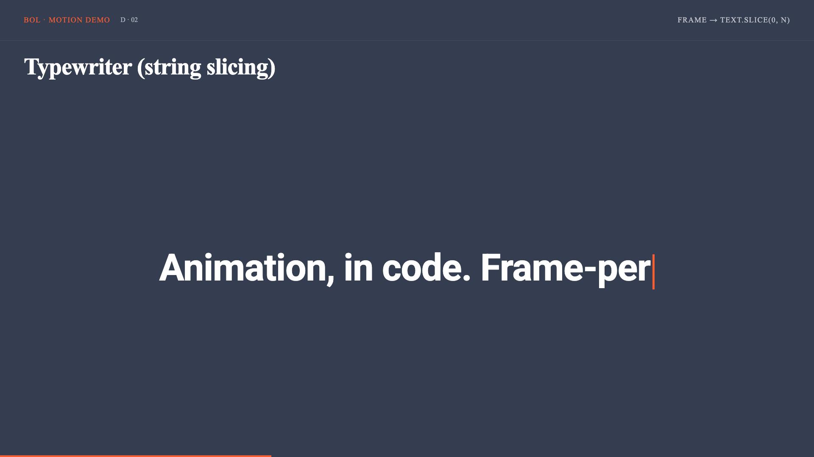

#### `HighlightPen` &nbsp; _Duration: 6s_

A spring-driven `scaleX` wipe paints highlight blocks behind two phrases — cyan behind "brand book", orange behind "Remotion project". The wipe lands left-to-right, like a real highlighter pen.

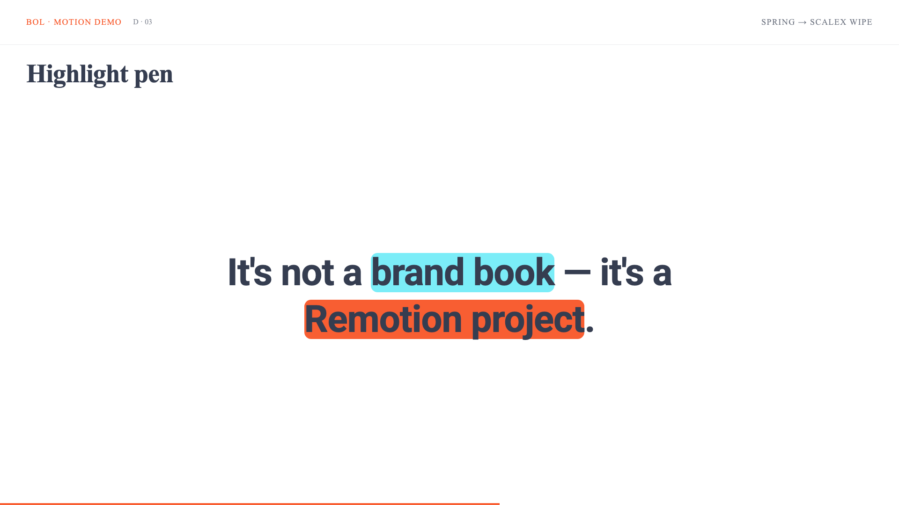

---

### E. Visual effects — _the atmosphere_

#### `PathsAndShapes` _(existing)_ &nbsp; _Duration: 6s_

A BOL-orange star draws itself stroke-by-stroke (`evolvePath`), then springs into a filled shape. Demonstrates `@remotion/paths` and `@remotion/shapes`.

#### `LightLeaks` &nbsp; _Duration: 6s_

Real WebGL light leak from `@remotion/light-leaks`, hue-shifted toward BOL orange. Sequenced so the title is readable before and after the leak sweeps.

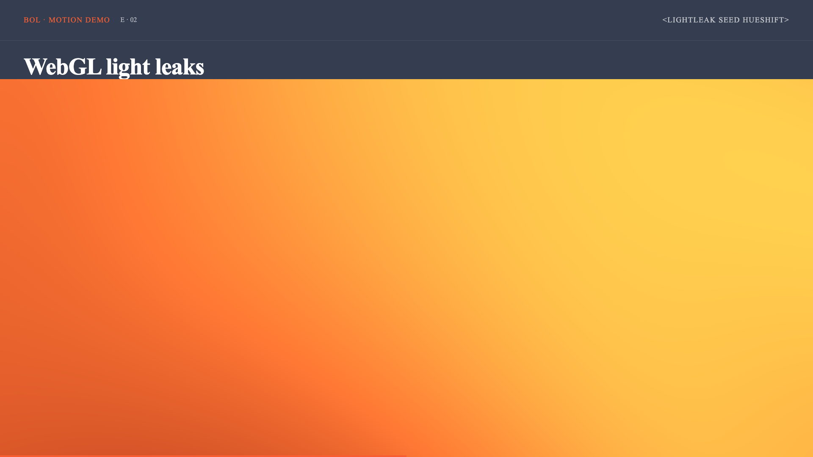

> **Talking point:** "These are zero filters — no Photoshop overlays, no After Effects composites. WebGL shaders rendered per frame. Different `seed` values give different patterns, identical brand DNA."

---

### F. Data / charts — _the case studies_

#### `BarChart` &nbsp; _Duration: 6s_

Eight monthly bars spring up with a stagger delay. The skill-pack rule for charts is non-negotiable: **disable third-party library animations and drive everything from `useCurrentFrame()`** — otherwise frames flicker during render.

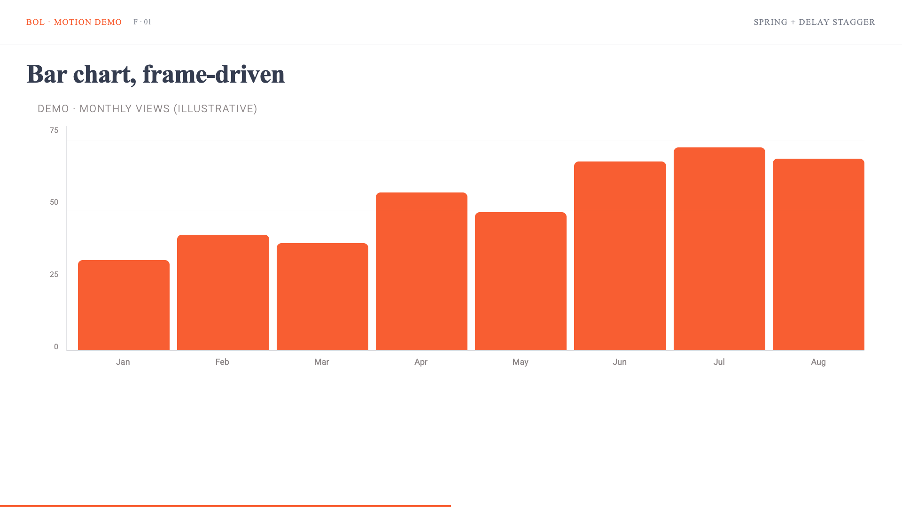

#### `PieChart` &nbsp; _Duration: 6s_

Four segments draw via SVG `stroke-dasharray`, starting from 12 o'clock. Legend fades in alongside, color-matched.

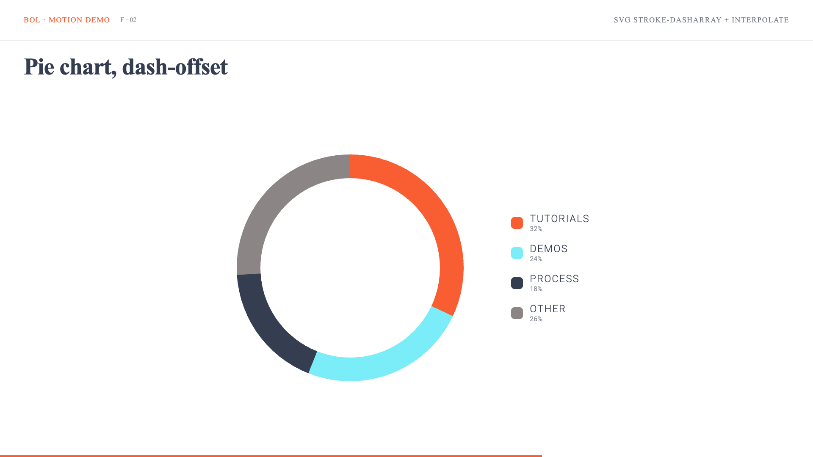

#### `LineChartMarker` &nbsp; _Duration: 6s_

Year-over-year growth line draws across, with an arrow that follows the head of the line in real time using `getPointAtLength` + `getTangentAtLength`. Big "+312%" reveal lands after the line completes.

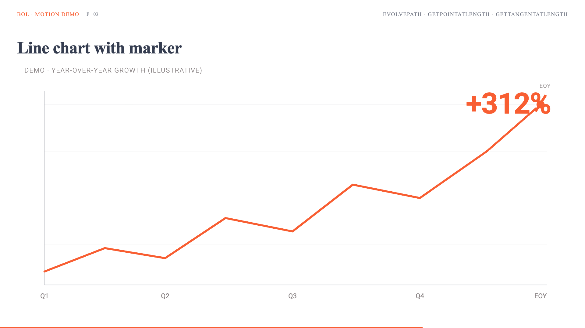

> **Talking point:** "This is the case-study slide we hand-animated in After Effects three times last year. From now on, the data lives in a JSON file and the slide animates itself."

---

### G. Media — _audio and video_

#### `AudioCaptions` _(existing)_ &nbsp; _Duration: 8s_

ElevenLabs voiceover plays. A 32-bar real frequency-spectrum waveform pulses with the audio. Word-by-word captions highlight in BOL orange in sync. Demonstrates `<Audio>`, `useAudioData`, `visualizeAudio`.

---

### H. 3D — _real depth_

#### `ThreeScene` _(existing)_ &nbsp; _Duration: 6s_

A BOL-orange torus knot rotating in 3D, lit with two directional lights (warm key, cyan rim). Uses `@remotion/three` + `@react-three/fiber` — full Three.js inside Remotion.

> **Talking point:** "Anything we'd do in Cinema 4D for a hero shot can live here too — same React mental model."

#### `ThreeStack` &nbsp; _Duration: 6s_

Three rotating cubes stacked on a graphite background — cyan top, orange middle, graphite bottom. Each cube's `meshStandardMaterial` reads its color directly from `theme.ts`, demonstrating that **brand colors travel into 3D the same way they travel into 2D** — one source of truth, every render.

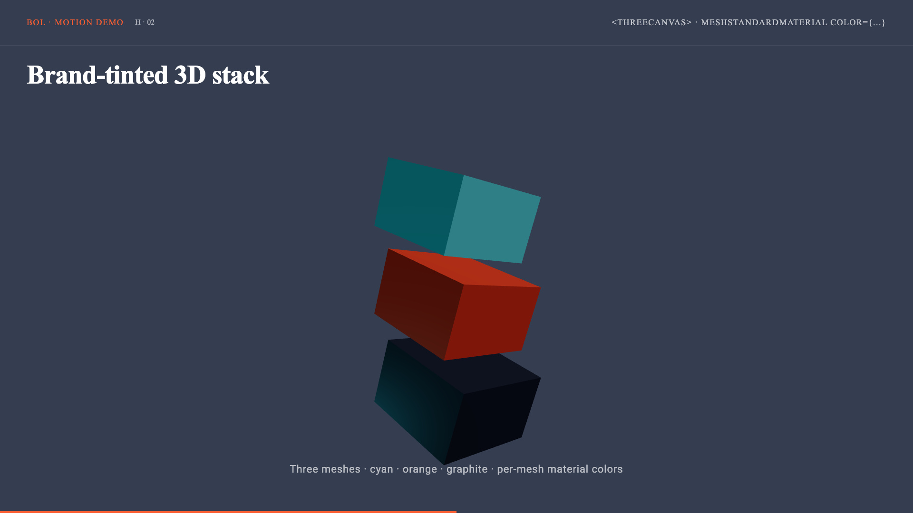

> **Talking point:** "Same brand kit. The orange in this cube is the orange in the title card from scene 1. Change it once, every shot updates."

#### `ThreeOrbitField` &nbsp; _Duration: 8s_

A graphite core sphere with twelve smaller spheres orbiting around it in a ring. Satellites alternate orange / cyan / light gray, indexed by position. The ring tilts slightly so the 3D structure reads.

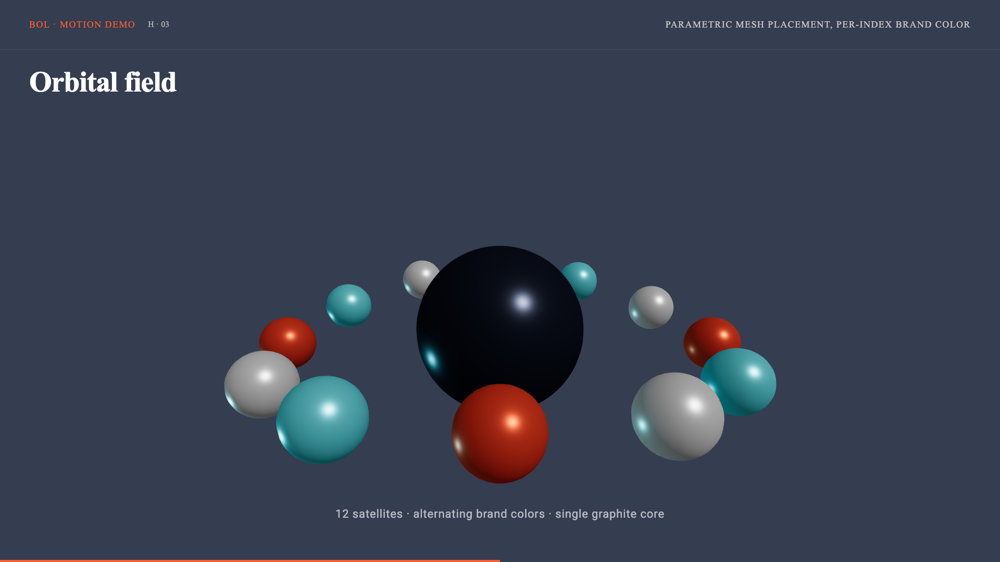

> **Talking point:** "Multi-mesh scenes are the same loop you'd write in 2D — `Array.from({length: 12}).map(i => <mesh ... />)`. Three.js is just the React component on the inside."

---

### I. Transitions — _between vignettes_

#### `TransitionGallery` &nbsp; _Duration: 8s_

Cycles through five `@remotion/transitions` presentations back-to-back: `fade()`, `slide()`, `wipe()`, `flip()`, `clockWipe()`. Each card labels the transition that preceded it.

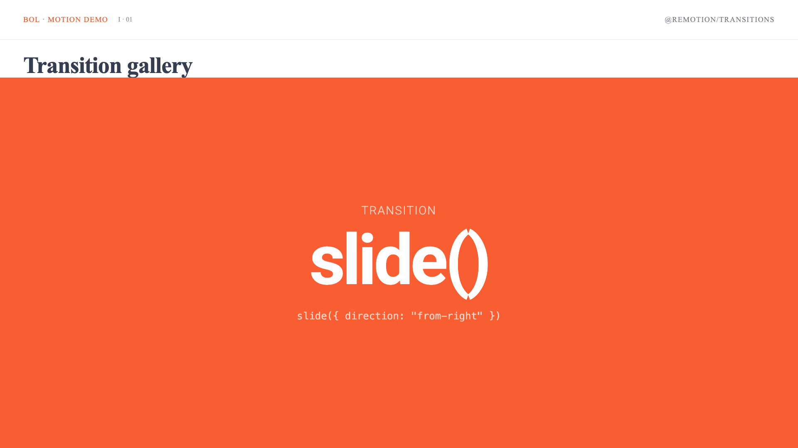

> **Talking point:** "These are the join cuts between vignettes. The `Showcase` composition uses three of them already."

---

### J. Parametric — _one composition, many videos_

#### `ParametricCard` &nbsp; _Duration: 4s_

A title card backed by a Zod schema. The right-side **Props panel** in the studio is auto-populated with editable controls — text inputs for headline/subtitle, color pickers (via `zColor()` from `@remotion/zod-types`) for accent and text colors, a dropdown for background mode, a number slider for underline width, a checkbox for the underline. Edit any value and the preview re-renders live.

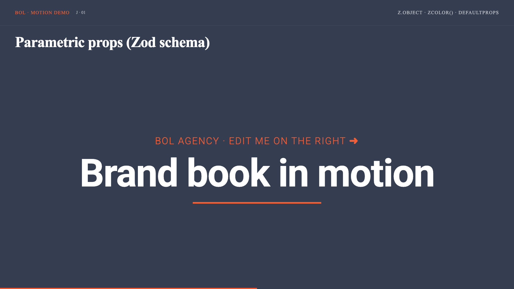

> **Talking point:** "This is the personalization story. The Props panel is just the design-time view of the schema — at render time, we pass `--props='{...}'` and produce as many variants as we want from one composition. 200 welcome videos, 200 different names, one composition file."

---

### K. External integrations

#### `LottieScene` _(existing)_ &nbsp; _Duration: 6s_

A Lottie animation loaded from `public/lottie/animation.json` plays inside a BOL-themed dashed frame. **Drop in any brand-authored Lottie JSON** and it just works.

> **Talking point:** "When designers in After Effects export a Lottie, this is where it lands — designer-authored animation, in our codebase."

#### `LottieRecolored` &nbsp; _Duration: 6s_

The same Lottie, side-by-side. Left pane: original palette as shipped from LottieFiles. Right pane: same JSON re-skinned to the BOL palette via a runtime `recolorLottieToBrand()` mutation. The mutation maps each source color onto a brand-color band by **luminance** — darkest source colors land on Graphite, lightest on Light Gray, mids on Orange and Cyan. **No editing the source Lottie required.**

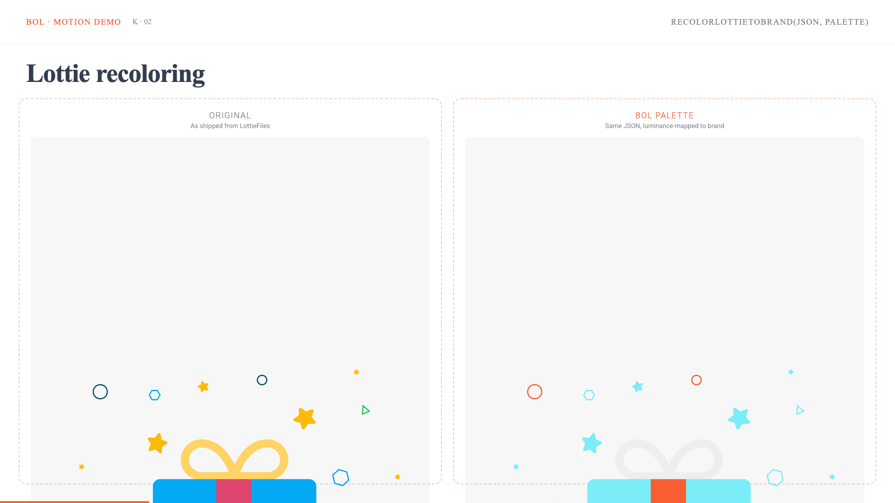

> **Talking point:** "Designers ship us a Lottie in their preferred colors. Three lines of code re-skin it to BOL. Their original file isn't touched — we just read it through a brand filter at render time."

The utility lives at [`src/lib/recolorLottie.ts`](src/lib/recolorLottie.ts) and works on any Lottie animation. It also exposes `recolorLottieExplicit()` for cases where you want exact source-to-target color mapping rather than luminance bands.

---

### L. Closing

#### `Outro` _(existing)_ &nbsp; _Duration: 8s_

Closing card. "Made with Remotion · BOL Agency · brand book in motion." Mirrors the opening title.

---

## 5. The master timeline

#### `Showcase` &nbsp; _Composition: `Showcase`_ &nbsp; _Duration: 50s_

A curated 7-vignette walkthrough, transitioned together with `TransitionSeries`:
**Title → Spring vs Interpolate → Sequenced Text → Paths and Shapes → Audio + Captions → Lottie → Three.js → Outro**

This is the candidate for the staff demo cut. Once you pick favorites from the audition, we update `Showcase.tsx` to swap in your top picks.

---

## 6. Practical considerations

### Where Remotion fits

- **Hero shots & explainers** — short-form, brand-driven, motion-heavy.
- **Personalized variants** — one template, N renders driven by data.
- **Data visualizations** — animated bar/line/pie charts that always match the source data.
- **Lower-thirds & promo cuts** — repeatable formats with brand consistency.

### Where it doesn't fit (yet)

- **Hand-animated character work** (use Rive or After Effects, then drop in via Lottie).
- **Long-form narrative editing** (use Premiere — Remotion isn't a NLE).
- **Live broadcasts** — Remotion is for pre-renders.

### Render targets

- **Studio** — instant preview at `localhost:3001`, what you've been seeing.
- **Local CLI** — `pnpm -C apps/bol-remotion-demo build` produces an MP4.
- **Lambda / Cloud Run** — render at scale; produce 1000 personalized videos in parallel via `@remotion/lambda`.

### Cost

Studio + local renders are free. Lambda renders are billed per second of GPU/CPU; a 30-second 1080p render costs ~$0.05–0.20.

---

## 7. Suggested 60-second show reel (Kelly's pick)

After scrubbing the audition pool, replace the Showcase composition with whatever 7–8 vignettes feel most "BOL". My early bet (you'll override this):

1. **Title** (4s)
2. **FrameRuler** (4s — pedagogical hook)
3. **EasingZoo** (5s — primitives)
4. **HighlightPen** (5s — typography)
5. **LineChartMarker** (6s — data viz, biggest "wow")
6. **LightLeaks** (5s — atmosphere)
7. **ThreeScene** (5s — 3D)
8. **AudioCaptions** (8s — audio sync)
9. **Outro** (4s)

Total: ~46s + transition overlap.

---

## 8. Next steps after the audition

1. Pick favorites from the studio (Kelly).
2. I rewrite `Showcase.tsx` with the chosen scenes + transitions.
3. We pick a final voiceover line, regenerate via ElevenLabs.
4. Tune caption timing against the audio (frame-by-frame in `AudioCaptions.tsx`).
5. Render at 1920×1080 @ 30fps via `pnpm build`.
6. Show staff.

---

## Appendix: file map

| Concern                         | File                                                                 |
| ------------------------------- | -------------------------------------------------------------------- |
| Brand tokens                    | [src/styles/theme.ts](src/styles/theme.ts)                           |
| Shared scene frame              | [src/components/VignetteFrame.tsx](src/components/VignetteFrame.tsx) |
| Scene registry                  | [src/scenes/index.ts](src/scenes/index.ts)                           |
| Master timeline                 | [src/scenes/Showcase.tsx](src/scenes/Showcase.tsx)                   |
| Composition entry               | [src/Root.tsx](src/Root.tsx)                                         |
| Project config (dimensions/fps) | [src/project.config.ts](src/project.config.ts)                       |
| Build/render scripts            | [package.json](package.json)                                         |
